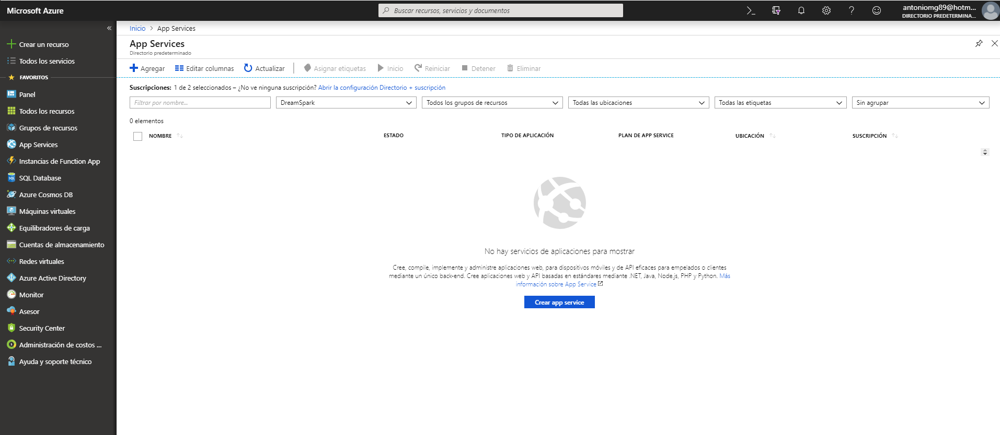
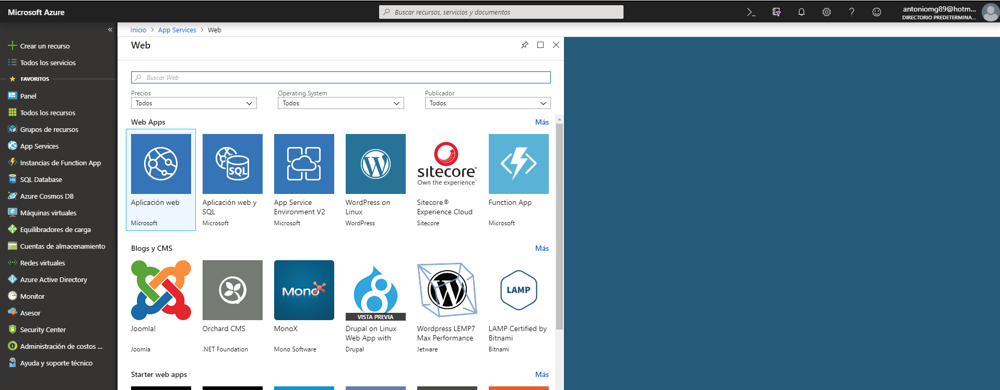
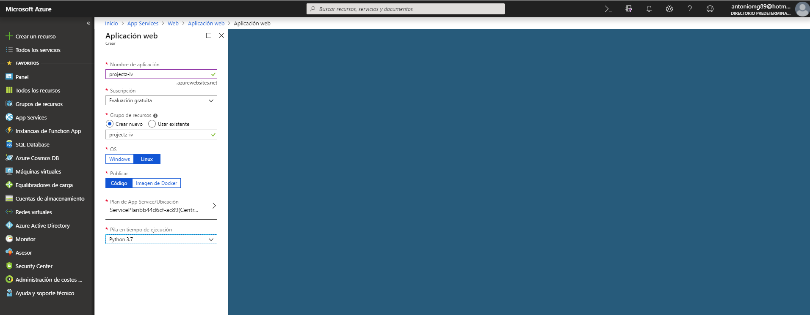
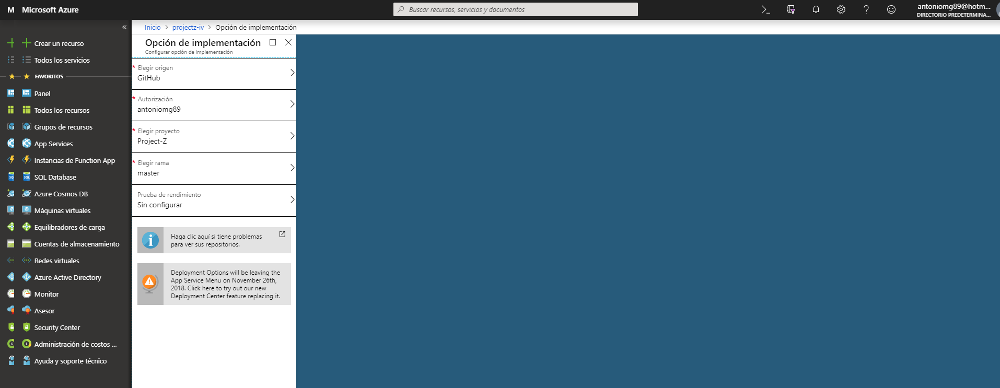
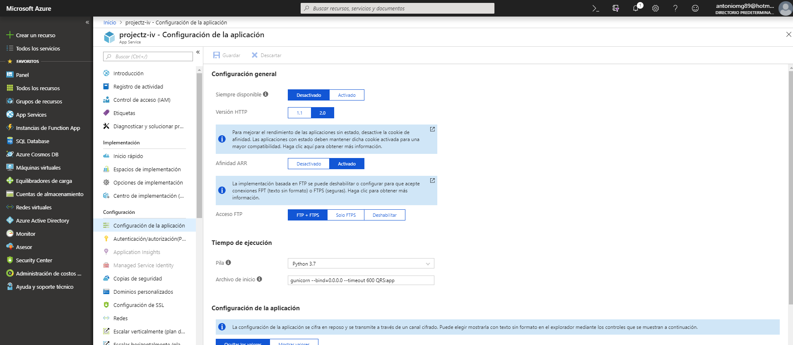

# Azure

Se ha elegido este PaaS por los mismo motivos que Heroku, su uso es sencillo y cubre las necesidades del servicio web.

### Pasos para realizar el despliegue

1. Crear una cuenta de Microsoft Azure o acceder a las ofrecidas por parte del profesor.

2. Crear la aplicación web.  
 
 

3. Se selecciona el nombre de la aplicación. Se crea un recurso para para ella o se usa uno existente. Se establece el SO, la publicación (código) y finalmente el lenguaje de programación (Python)  
 

4. En las opciones de implementación de la aplicación se elige como origen GitHub, se realiza la autorización de la cuenta de GitHub y se selecciona el repositorio donde se encuentra la aplicación.  
 

5. En último lugar, en caso de que el archivo principal de la aplicación no se llame "application.py", debe añadirse en archivo de inicio como comando "gunicorn --bind=0.0.0.0 -timeout 600 QRS:app" de esta forma se establece el nombre del archivo principal asociado a la aplicación (QRS)  
 

 Finalmente se accede al enlace de la aplicación que ofrece Azure y se comprueba el [correcto despliegue](https://projectz-iv.azurewebsites.net/genQR).
