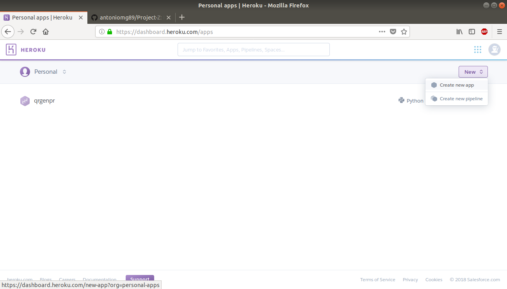
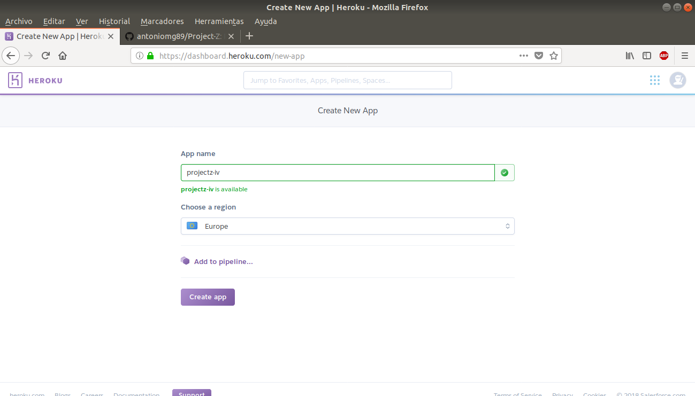
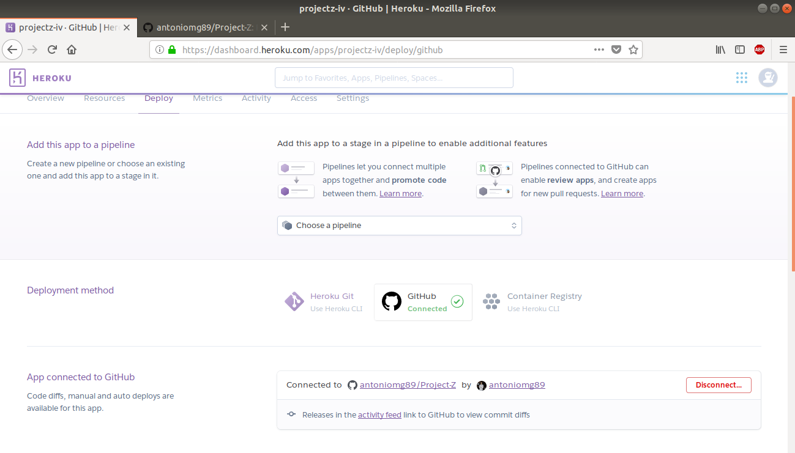
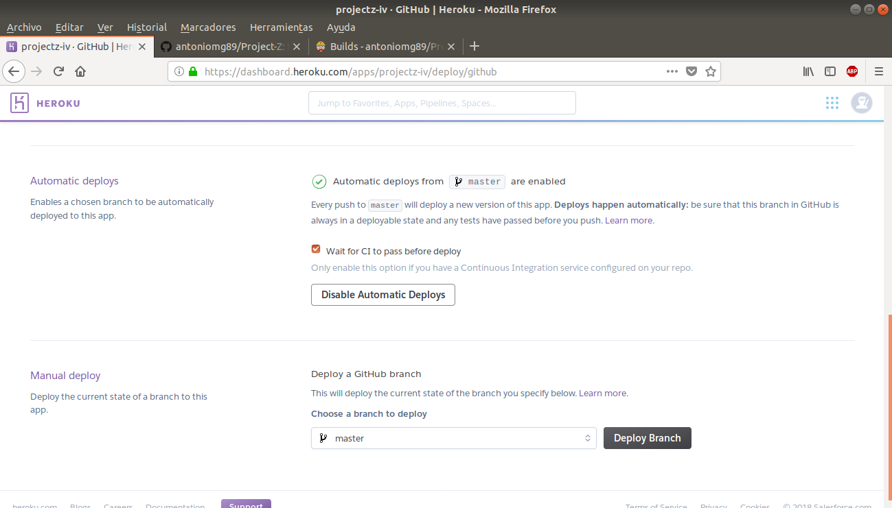

# Heroku

Se ha elegido este PaaS debido a que ha sido utilizado previamente, proporciona todo lo necesario para el servicio que se está llevando a cabo y su uso es sencillo.

### Pasos para realizar el despliegue

1. Registrarse en [Heroku](https://www.heroku.com/).

2. Crear la aplicación.  
 

3. Seleccionar un nombre para la aplicación.  
 

4. Se establece Github como método de despliegue y se conecta con el repositorio deseado (Project-Z).  
 

5. Se activa el despliegue automático al pasar los tests de travis.  
 

6. Como último paso (o primero) debe crearse un archivo Procfile en el directorio raiz del repositorio donde se declara un proceso tipo web y a continuación haciendo uso de gunicorn se establece la app asociada (QRS)

Finalmente se accede al enlace de la aplicación que ofrece Heroku y se comprueba el [correcto despliegue](https://projectz-iv.herokuapp.com/genQR).
