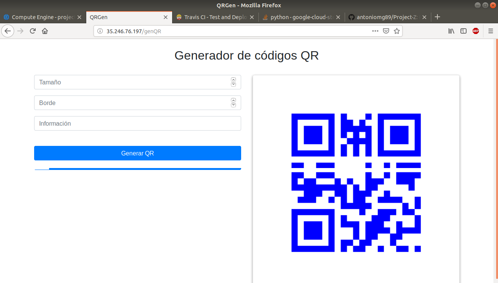

# Despliegue final

Se ha hecho uso de vagrant para lanzar la vm y ansible como provisionamiento.

A continuación se muestra el fichero de provisionamiento de ansible:

~~~
# Hosts a los que conectarse para realizar el provisionamiento.
- hosts: all

  #Se va a hacer uso del superusuario para ejecutar gunicorn.
  #sudo: yes

  # Usuario a utilizar.
  remote_user: amgarcia

#  vars:
#    service_account_file: /home/amgarcia/II/Pruebas/projectz-1cb22d1d7fc5.json
#    project: projectz
#    auth_kind: serviceaccount

  # Tareas a realizar.
  tasks:

    # Agregar repositorio python 3.6
    - name: Agregar repositorio
      become: true
      apt_repository: repo=ppa:deadsnakes/ppa state=present

    # Actualizar apt.
    - name: Actualizar apt
      become: true
      apt:
        upgrade: yes
        update_cache: yes

    # Instalar Python 3.6.
    - name: Instalar Python 3.6
      become: true
      apt: pkg=python3.6 state=present

    # Instalar pip
    - name: Instalar pip
      become: true
      apt: pkg=python-pip state=latest

    # Instalo pip3.
    - name: Instalar pip3
      become: true
      apt: pkg=python3-pip state=latest

    # Instalar setuptools.
    - name: Instalar setuptools
      become: true
      pip: name=setuptools state=latest

    # Instalar git
    - name: Instalar git
      become: true
      apt: pkg=git state=latest

    # Clonar el repositorio de github
    - git:
        repo: https://github.com/antoniomg89/Project-Z.git
        dest: /vagrant/prz

    # Instalar Flask.
    - pip:
        name: Flask
        executable: pip3

    # Instalar Jinja2.
    - pip:
        name: Jinja2
        executable: pip3

    # Instalar Pillow.
    - pip:
        name: Pillow
        executable: pip3

    # Instalar qrcode.
    - pip:
        name: qrcode
        executable: pip3

    # Instalar gunicorn.
    - pip:
        name: gunicorn
        executable: pip3
~~~

Una vez se tiene el playbook.yml de ansible se configura el archivo Vagrantfile con la información necesaria para la creación de la vm:

~~~
Vagrant.configure("2") do |config|
    # VM.
    config.vm.box = "google/gce"

    config.vm.provider :google do |google, override|
        # ID del proyecto en google cloud platform.
        #google.google_project_id = ENV['ID_GCP']
        google.google_project_id ="projectz"

        # Email.
        #google.google_client_email = ENV['CEM']
        google.google_client_email = "iv-524@projectz.iam.gserviceaccount.com"

        # clave cuenta de servicio.
        #google.google_json_key_location = ENV['JLOC']
        google.google_json_key_location = "/home/amgarcia/II/proz.json"

        google.image_family = 'ubuntu-1604-lts'
        google.zone = 'europe-west2-a'
        google.name = 'projectz'
        google.machine_type = 'g1-small'

        # Configuración de usuario y clave privada para la conexión por SSH.
        override.ssh.username = 'amgarcia'
        override.ssh.private_key_path = '~/.ssh/google_compute_engine'
    end

    # Provisionamiento Ansible.
    config.vm.provision "ansible" do |ansible|
      ansible.playbook = "provision/playbook.yml"
    end
end
~~~

Para que se cree la vm de google es necesario instalar el plugin de google para vagrant.

También es necesario generar uns pareja de claves privada/pública para la conexión por ssh. Con la pareja creada (google_compute_engine, google_compute_engine.pub) se introduce el valor de la clave pública en los metadatos del proyecto quedando de la siguiente manera:

También es necesario crear una clave JSON de cuenta de servicio del proyecto:

Para crear la máquina por primera vez:

~~~
$vagrant up --provider=google
~~~

Ahora en la consola de google tenemos que habilitar a nuestra vm para recibir peticiones http/https que por defecto están deshabilitadas:

Cuando ya está creada la vm se realiza:

~~~
$vagrant up
$vagrant provision
~~~

Para terminar, con la vm creada y provisionada, se procede al despliegue del servicio con fabric:

**(Actualización en referencia a los problemas con la instalación de fabric)**

Como puede observarse, el apartado del despliegue con fabric estaba sin documentar.

Con respecto al tema de la ejecución del archivo fabfile.py el último viernes en clase hice un primer fabfile.py con lo siguiente:

~~~
from fabric.api import *

def IniciarApp():
# Iniciar aplicación.
  run ('echo inicia app')
  run('python3 /vagrant/prz/QRS.py &')
~~~

Cuando le enseñé esta versión a JJ, siguiendo su sugerencia, cambié la orden **run('python3 /vagrant/prz/QRS.py &')** por la correspondiente usando gunicorn, quedando el archivo fabfile.py así:

~~~
from fabric.api import *

def IniciarApp():
# Iniciar aplicación.
  run ('echo inicia app')
  run('cd /vagrant/prz/ && sudo gunicorn QRS:app -b 0.0.0.0:80')
~~~

Con esto ya solo hacía falta introducir en la terminal:

~~~
$fab IniciarApp()
~~~

Pero debido a problemas con la instalación de fabric me daba error en la ejecución del comando anterior.
Estuve probando a instalar fabric con pip y con apt-get, pero el problema persistía (y a día de hoy también, incluso probando con otro ordenador).
Debido a esto y ante la necesidad de enviar el hito tuve que lanzar la aplicación a través de gcloud con el mismo comando que puse en el fabfile:

~~~
gcloud compute ssh --zone europe-west2-a projectz -- 'cd /vagrant/prz && sudo gunicorn QRS:app -b 0.0.0.0:80'
~~~

De esta forma pude lanzar de forma correcta la aplicación.

En relación al archivo fabfile.py creo que está de forma correcta.

He hecho esta actualización para dejar claro como he realizado el apartado del despliegue en vista de no haber solucionado los problemas previamente mencionados y que se me resten los puntos pertinentes en relación a este tema.

**(Fin actualización)**

Comprobamos que se puede acceder a nuestra dirección (http://35.246.76.197/genQR):

Queda pendiente pasar el ID del proyecto, email y clave de cuenta de servicio como variables de entorno en el vagrantfile.
