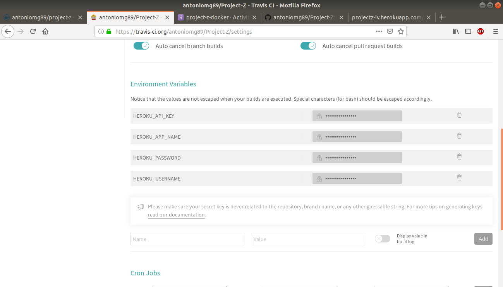

# Documentación de Docker

Se ha cambiado el funcionamiento de realizar tests y desplegar en este hito al incorporar Docker.

Anteriormente se realizaban los tests con Travis y si eran correctos se realizaba un despliegue automático en Heroku.

El funcionamiento a partir de ahora será el siguiente:

1. Se pasan los tests en Travis.
2. Si son correctos se crea/actualiza el contenedor Docker y se sube a Docker Hub.
3. Se despliega este contenedor en Heroku.

Con este nuevo funcionamiento lo conveniente es manejar todo desde travis.yml.

### Pasos para configurar el nuevo sistema:

Suponemos que ya tenemos una cuenta creada en Heroku y Travis enlazado al repositorio.

#### 1. Crear una cuenta en [Docker Hub](https://hub.docker.com/).

#### 2. Configuracion travis.yml y Docker

Como se va a ejecutar el comando docker para construir el contenedor es necesario indicar en el archivo que se va a hacer uso de **sudo**:

~~~
sudo: required

services:
  - docker
~~~

El siguiente paso es iniciar sesión en Docker Hub:

~~~
sudo: required
language: python
python:
  - "3.6"

services:
  - docker

before_install:
  - wget -qO- https://toolbelt.heroku.com/install.sh | sh
  - echo "$DOCKER_PASSWORD" | docker login -u "$DOCKER_USERNAME" --password-stdin
~~~

Para iniciar la sesión se crean dos variables de entorno (DOCKER_PASSWORD y DOCKER_USERNAME) en Travis. Estas variables creadas contendrán el usuario y contraseña de Docker Hub.

Ahora que ya se ha iniciado sesión ya se puede construir la imagen y hacer un push a Docker Hub.

~~~
sudo: required
language: python
python:
  - "3.6"

services:
  - docker

before_install:
  - echo "$DOCKER_PASSWORD" | docker login -u "$DOCKER_USERNAME" --password-stdin

install:
  - pip3 install -r requirements.txt

script:
  - pytest
  - docker build -t antoniomg89/project-z-iv .

deploy:
  provider: script
  script:
    docker push antoniomg89/project-z-iv;
branch: master
~~~

En el push indicamos nombrecuenta/repositorio donde se va a subir la imagen.

Con lo realizado hasta ahora el despliegue siempre será posterior a la ejecución de los tests, de esta forma si fallasen no se ejecutan las instrucciones de *deploy*.

Con *branch: master* se indica el cambio a dicha rama en el despliegue para asegurarnos en caso de tener alguna otra más.

Hasta ahora tendríamos la parte de tests y docker realizada.

#### 3. Configuracion travis.yml y Heroku

El siguiente paso es realizar el despliegue del contenedor en Docker Hub a Heroku. Para ello es necesario tener instalado Heroku CLI.

~~~
before_install:
  - wget -qO- https://toolbelt.heroku.com/install.sh | sh
  - echo "$DOCKER_PASSWORD" | docker login -u "$DOCKER_USERNAME" --password-stdin
- echo "$HEROKU_PASSWORD" | docker login -u "$HEROKU_USERNAME" --password-stdin registry.heroku.com
~~~
Esta parte contiene la instalación de Heroku CLI y el inicio de sesión en Heroku.

Con esto es necesario agregar dos variables de entorno más en Travis (HEROKU_PASSWORD y HEROKU_USERNAME).

La variable HEROKU_USERNAME ha de ser: **_**

Para HEROKU_PASSWORD ha de generarse un token con Heroku CLI de la siguiente forma:

~~~
$heroku authorizations:create
~~~

A continuación en Heroku, seleccionamos la aplicación creada previamente en el anterior hito, pero ya no la vinculamos con el repositorio de Github puesto que lo que queremos es que se realize el despliegue desde el contenedor y no desde el repositorio de Github.d

El nombre de la aplicación en Heroku también lo añadimos a una nueva variable de entorno en Travis ($HEROKU_APP_NAME).

Una vez realizado esto hay que hacer un push de la imagen de Docker en Heroku en travis.yml:

~~~
script:
  - pytest
  - docker build -t antoniomg89/project-z-iv .
  - docker tag antoniomg89/project-z-iv registry.heroku.com/$HEROKU_APP_NAME/web

deploy:
  provider: script
  script:
    docker push antoniomg89/project-z-iv;
    docker push registry.heroku.com/$HEROKU_APP_NAME/web;

branch: master
~~~

Para terminar se hace uso del comando heroku release. Esto requiere de otra variable de entorno en Travis (HEROKU_API_KEY) ya que es necesario estar autentificado en Heroku CLI. El valor de esta variable lo obtenemos de la cuenta creada en Heroku:

Para terminar se añade el último comando para realizar el despliegue quedando el archivo travis.yml así:

~~~
sudo: required
language: python
python:
  - "3.6"

services:
  - docker

before_install:
  - wget -qO- https://toolbelt.heroku.com/install.sh | sh
  - echo "$DOCKER_PASSWORD" | docker login -u "$DOCKER_USERNAME" --password-stdin
  - echo "$HEROKU_PASSWORD" | docker login -u "$HEROKU_USERNAME" --password-stdin registry.heroku.com

install:
  - pip3 install -r requirements.txt

script:
  - pytest
  - docker build -t antoniomg89/project-z-iv .
  - docker tag antoniomg89/project-z-iv registry.heroku.com/$HEROKU_APP_NAME/web

deploy:
  provider: script
  script:
    docker push antoniomg89/project-z-iv;
    docker push registry.heroku.com/$HEROKU_APP_NAME/web;
    heroku container:release web --app $HEROKU_APP_NAME
branch: master
~~~

Las variables de entorno creadas en Travis quedarían así:

De esta forma cada vez que se haga un push en el repositorio de Github se realiza todo de forma automática(Tests, Docker y Heroku).
